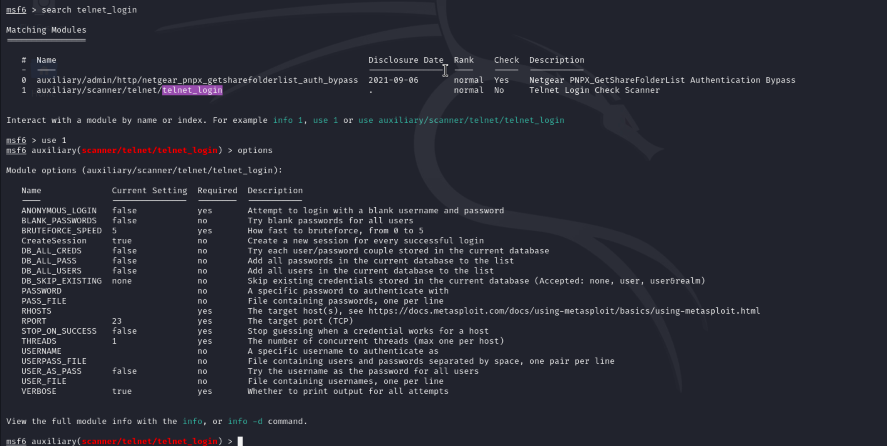

## SWS101 CAP1

### Execute Summary

-  **Github link for evidence** 

- **Approaches**

We were given a machine where we were asked to do penetration testing on that machine which was deployed in our college network and check how secure the machine was if it was to be deployed on the internet.
We did some penetration testing on the machine without proper knowledge of the internal environment of the machine  with the goal to exploit vulnerabilities that were present in the machine. I looked into each of  the vulnerabilities carefully and tired the to exploit them by googling the vulnerabilities so that i can get the root access of the machine.

- **Scopes** 

The scope of this penetration testing was to check how secure the machine was that one our lecture deployed on the college network and find the vulnerabilities before  deploying  it on the internet. We were asked to do it on a particular host with the IP address 10.3.21.140 on the GCBS network.

- **Assessment Overview and Recommendations**

The main objective of this assignment is to conduct penetration testing on a host target with IP address of 10.3.21.140 on the GCBS network to identify the security vulnerabilities and provide recommendation to improve them.

During the penetration testing I firstly started  by doing a nmap to the host to check the open ports that were available or not and after doing the nmap scan I found out that there were 28 open ports on the SWE_office@ wifi that were all vulnerable .  I went through all the ports and found out that most of the ports were exploitable by metasploit though i tried many other way but using metasploit I was successfully able to gain the root access to some of the ports.

During my penetration testing task i found out that, using metasploit  I can gain root of the machine by exploiting the open ports. I did tried to exploit all the ports but I could only successfully exploit five ports that were open on the networks (SSH, FTP, TELNET, postgresSQl, HTTP ). In which for most of the ports I used metasploit for exploit the ports, for SSH I could successfully gain the root access of the by brute forcing the user name and passwords that were externally created and I was able to crack the password and username  and gain the root access, it goes same for all the other ports except for FTP port where i used hydra to brute force the password and username.

---

### Network Penetration Test Assessment Summary

I began my penetration testing from a hacker's point of view on finding how to get into the machine and gain root access before even thinking that I was doing it to avoid them. We were only given with the machine's IP address and after that everything was upon us to exploit the machine.
After my finding I found out that the machine was very vulnerable and can be exploited very easily by anyone with some little knowledge of network security as most of the ports that are open are very much vulnerable.

---

### Network Compromise Walkthrough

These are the steps that I took in order to exploit the different ports that were open  and also a demonstration on how a hacker and gain the root access of the machine.
 
Before anything i did a nmap scan on the on the host's IP address to check the ports that were open and can be exploited

As we can see in the above nmap scan that there are almost 30 ports open on this machine.

So i tried  exploiting FTP,  SSH, TELNET, postgresql, and http.

The user.txt and passwords.txt file were created inside my root directory so that i could used to brute force the username and passwords.

In this port I went about using hydra to brute force the username and password for logging into FTP.

We can see that the password and username match with “ service” and  “ postgres” after brute forcing with hydra.

Next I tried to login to the FTP with credentials that I got from brute forcing with Hydra and I was successful to login to the FTP and gain access to it.

After logging in  I created a file “ GLICHER_was_here” to keep evidence that I was in the machine from  exploiting port 21  FTP.

I also tried exploiting it with metasploit but somehow it did not work as I am using a VM where it didn't create a session for me to get in.

- **Port 22/tcp SSH**

For SSH port 22 I used metasploit to exploit it. Inside metasploit I used the search operation to find the ssh_login so that I could exploit it and get access to the machine through SSH port.

After that I found the auxiliary to login to ssh and used it to further more, i viewed the option to set the default option my options where i set the rhost to 10.3.21.140, and i also set the user_file to user.txt and pass_file to passwords.txt and i changed  the other settings according as well.

After that I ran it to exploit it and a session was created and i got into  the session after i got into the session I tried to configure whether I could access it or not and gave the command “whoami” and i got the output as service which was true and indicating i got the access.

After i got the root access I created a folder called “GLICHER_also_was_here_in_ssh”.

- **Port 80/tcp http**

In this port i first used searchsploit to search for details  about the apache version and also to find the vulnerable server present among them.

From here I found that apache is supported by php with i tried to get the information about php, so i browsered it.

Than I found out that i php was supported by CGI.

After opening metasploit I searched for php_cgi and used it. After that i changed the changed the default setup to the required setup.

But somehow a session was not created so I could not processed further, but still this port was vulnerable to exploits.

- **Port 23/tcp telnet**

For this port as well I used metasploit to exploit where, inside metasploit i search for telnet_login. 

After this i viewed the options and set the required setup same as that in other exploits and ran it 

After this i could see that for both username and password it was “service” and a session was created so i used that session and again i was in and got the access.

And here as well I made a folder “GLICHER_was_here” for evidence that i got in.

- **Port 5432/tcp postgresql**

Same as all other ports i used metasploit and inside metasploit i searched for postgres.

From here I used postgres_login and did the same as above ports. Where I viewed the options and again set the options as required and ran it.

And yet again i got my credential right to login to postgres. After that i opened a new tab in the terminal and used to credential to login to the postgres

Where i was successful to do so and as evidence i created table “glicher”. 

---

 ### Remediation Summary

Since this machine was an outdated version, outdated versions can lead to information loss and unauthorized access so we need to update the version. We also need to use multi-factor authorization to put up an extra layer of protection. We also need the strengthen the passwords with longer characters in the passwords for all the ports.
Replace FTP with more security like SFTP.

