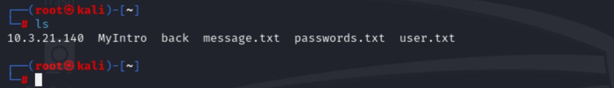

## SWS101 CAP1

### Execute Summary

-  **Github link for evidence** 

- **Approaches**

We were given a machine where we were asked to do penetration testing on that machine which was deployed in our college network and check how secure the machine was if it was to be deployed on the internet.
We did some penetration testing on the machine without proper knowledge of the internal environment of the machine  with the goal to exploit vulnerabilities that were present in the machine. I looked into each of  the vulnerabilities carefully and tired the to exploit them by googling the vulnerabilities so that i can get the root access of the machine.

- **Scopes** 

The scope of this penetration testing was to check how secure the machine was that one our lecture deployed on the college network and find the vulnerabilities before  deploying  it on the internet. We were asked to do it on a particular host with the IP address 10.3.21.140 on the GCBS network.

- **Assessment Overview and Recommendations**

The main objective of this assignment is to conduct penetration testing on a host target with IP address of 10.3.21.140 on the GCBS network to identify the security vulnerabilities and provide recommendation to improve them.

During the penetration testing I firstly started  by doing a nmap to the host to check the open ports that were available or not and after doing the nmap scan I found out that there were 28 open ports on the SWE_office@ wifi that were all vulnerable .  I went through all the ports and found out that most of the ports were exploitable by metasploit though i tried many other way but using metasploit I was successfully able to gain the root access to some of the ports.

During my penetration testing task i found out that, using metasploit  I can gain root of the machine by exploiting the open ports. I did tried to exploit all the ports but I could only successfully exploit five ports that were open on the networks (SSH, FTP, TELNET, postgresSQl, HTTP ). In which for most of the ports I used metasploit for exploit the ports, for SSH I could successfully gain the root access of the by brute forcing the user name and passwords that were externally created and I was able to crack the password and username  and gain the root access, it goes same for all the other ports except for FTP port where i used hydra to brute force the password and username.

---

### Network Penetration Test Assessment Summary

I began my penetration testing from a hacker's point of view on finding how to get into the machine and gain root access before even thinking that I was doing it to avoid them. We were only given with the machine's IP address and after that everything was upon us to exploit the machine.
After my finding I found out that the machine was very vulnerable and can be exploited very easily by anyone with some little knowledge of network security as most of the ports that are open are very much vulnerable.

---

### Network Compromise Walkthrough

These are the steps that I took in order to exploit the different ports that were open  and also a demonstration on how a hacker and gain the root access of the machine.
 
Before anything i did a nmap scan on the on the host's IP address to check the ports that were open and can be exploited

As we can see in the above nmap scan that there are almost 30 ports open on this machine.

So i tried  exploiting FTP,  SSH, TELNET, postgresql, and http.

The user.txt and passwords.txt file were created inside my root directory so that i could used to brute force the username and passwords.

